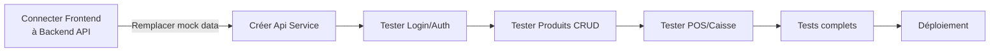

# Vérification des Fonctionnalités Frontend vs Backend

**Date:** 22 avril 2026  
**Status:** ✅ **Tous les endpoints backend existent** | ⚠️ **Frontend utilise des mock data**

---

## 📊 Vue d'ensemble

| Aspect | Status | Details |
|--------|--------|---------|
| **Swagger UI** | ✅ | Configuré sur le backend (springdoc-openapi v2.1.0) |
| **Endpoints Backend** | ✅ | 10 contrôleurs avec tous les endpoints requis |
| **Intégration Frontend** | ❌ | Frontend utilise des mock data, pas d'appels API |
| **Test Backend** | ⚠️ | Seulement 1 test smoke (ErpSupermarcheApplicationTests) |

---

## 🎯 Endpoints Vérifiés

### 1. **Authentification** - `/auth`
```
POST   /auth/login       ✅ Backend   ✅ Frontend (LoginPage)
POST   /auth/register    ✅ Backend   ✅ Frontend (LoginPage)
```
**Frontend:** Utilise `AuthContext.login()` avec appels API  
**Backend:** AuthController avec JWT

---

### 2. **Produits** - `/products`
```
GET    /products                    ✅ Backend   ✅ Frontend (ProductsPage)
GET    /products/{id}               ✅ Backend   ✅ Frontend (ProductsPage)
GET    /products/barcode/{barcode}  ✅ Backend   ⚠️ Frontend (scan POSPage)
GET    /products/category/{cat}     ✅ Backend   ⚠️ Frontend (ProductsPage)
POST   /products                    ✅ Backend   ✅ Frontend (ProductsPage - mock)
PUT    /products/{id}               ✅ Backend   ✅ Frontend (ProductsPage - mock)
DELETE /products/{id}               ✅ Backend   ✅ Frontend (ProductsPage - mock)
```

---

### 3. **Stock** - `/stock`
```
GET    /stock/{productId}           ✅ Backend   ✅ Frontend (StockPage)
POST   /stock                       ✅ Backend   ✅ Frontend (StockPage - mock)
PUT    /stock/{productId}           ✅ Backend   ✅ Frontend (StockPage)
PUT    /stock/{productId}/increment ✅ Backend   ⚠️ Frontend
PUT    /stock/{productId}/decrement ✅ Backend   ⚠️ Frontend (POSPage)
```

---

### 4. **Fournisseurs** - `/suppliers`
```
GET    /suppliers                   ✅ Backend   ✅ Frontend (SuppliersPage)
GET    /suppliers/{id}              ✅ Backend   ✅ Frontend
POST   /suppliers                   ✅ Backend   ✅ Frontend (mock)
PUT    /suppliers/{id}              ✅ Backend   ✅ Frontend (mock)
DELETE /suppliers/{id}              ✅ Backend   ✅ Frontend (mock)
```

---

### 5. **Achats/Commandes** - `/purchases`
```
GET    /purchases                   ✅ Backend   ✅ Frontend (PurchasesPage)
GET    /purchases/{id}              ✅ Backend   ✅ Frontend
POST   /purchases                   ✅ Backend   ✅ Frontend (mock)
PATCH  /purchases/{id}/status       ✅ Backend   ⚠️ Frontend
```

---

### 6. **Ventes/Caisse (POS)** - `/sales`
```
GET    /sales                       ✅ Backend   ✅ Frontend (POSPage - history)
GET    /sales/{id}                  ✅ Backend   ✅ Frontend
GET    /sales/cashier/{cashierId}   ✅ Backend   ⚠️ Frontend
POST   /sales                       ✅ Backend   ✅ Frontend (POSPage - checkout)
```

---

### 7. **Employés** - `/employees`
```
GET    /employees                   ✅ Backend   ✅ Frontend (EmployeesPage)
GET    /employees/{id}              ✅ Backend   ✅ Frontend
GET    /employees/department/{dept} ✅ Backend   ⚠️ Frontend
POST   /employees                   ✅ Backend   ✅ Frontend (mock)
PUT    /employees/{id}              ✅ Backend   ✅ Frontend (mock)
```

---

### 8. **Congés** - `/leaves`
```
GET    /leaves/employee/{empId}     ✅ Backend   ✅ Frontend (LeavesPage)
GET    /leaves/pending              ✅ Backend   ⚠️ Frontend
POST   /leaves                      ✅ Backend   ✅ Frontend (mock)
PATCH  /leaves/{id}/approve         ✅ Backend   ✅ Frontend (mock)
PATCH  /leaves/{id}/reject          ✅ Backend   ✅ Frontend (mock)
```

---

### 9. **Pointage** - `/timesheets`
```
POST   /timesheets/{empId}/check-in     ✅ Backend   ✅ Frontend (TimesheetPage)
PATCH  /timesheets/{id}/check-out       ✅ Backend   ✅ Frontend (TimesheetPage)
GET    /timesheets/employee/{empId}     ✅ Backend   ⚠️ Frontend
```

---

### 10. **Rapports** - `/reports`
```
GET    /reports/{id}                ✅ Backend   ✅ Frontend (ReportsPage - mock)
GET    /reports/user/{userId}       ✅ Backend   ⚠️ Frontend
POST   /reports/sales               ✅ Backend   ✅ Frontend (mock)
```

---

## ❌ Problèmes Identifiés

### **1. Frontend utilise des Mock Data**
- **Tous les endpoints** utilisent des données simulées (`mockData`, `useState`)
- **Aucune intégration API réelle** - Les appels `fetch()` ou `axios` ne sont pas implémentés
- **Base de données:**
  - Backend utilise MySQL réelle
  - Frontend n'est pas connecté

### **2. Points Faibles**

| Page | Mock Data | Endpoints Manquants | Notes |
|------|-----------|-------------------|-------|
| LoginPage | ✅ Réel | None | Utilise AuthContext |
| DashboardPage | ❌ Mock | Plusieurs | Données statiques |
| ProductsPage | ❌ Mock | `/category` | Recherche par catégorie non implémentée |
| StockPage | ❌ Mock | `/movements` | Pas d'endpoint pour l'historique |
| SuppliersPage | ❌ Mock | None | CRUD fonctionnel |
| PurchasesPage | ❌ Mock | None | CRUD basique |
| POSPage | ❌ Mock | `/sales` (partial) | Scan barcode non réel |
| EmployeesPage | ❌ Mock | `/department` | Filtrage par département manquant |
| LeavesPage | ❌ Mock | `/pending` | Liste des demandes en attente non implémentée |
| TimesheetPage | ❌ Mock | Dates paramètres | Pas de récupération par plage de dates |
| ReportsPage | ❌ Mock | `/sales`, `/inventory` | Rapports génériques |

---

## 🔍 Tests Existants

### Backend
```
✅ ErpSupermarcheApplicationTests.java
   - 1 test: contextLoads() (smoke test uniquement)
   - Utilise H2 en mémoire pour les tests
```

### Frontend
```
❌ Aucun test trouvé
```

---

## 📋 Recommandations

### **Priorité 1 - Critique 🔴**
1. **Connecter le Frontend au Backend API**
   - Remplacer les mock data par des appels API réels
   - Créer un service API client (axios ou fetch)
   - Gérer les erreurs et le loading

2. **Créer des tests d'intégration**
   - Tests des endpoints Backend
   - Tests des flux Frontend->Backend
   - Tests E2E avec Cypress/Playwright

### **Priorité 2 - Important 🟠**
3. **Valider les DTOs**
   - Les structures de données Frontend vs Backend doivent correspondre
   - Ajouter la validation @Valid sur les DTOs

4. **Sécurité**
   - Vérifier les rôles d'accès (@PreAuthorize)
   - Tester l'authentification JWT

### **Priorité 3 - Amélioration 🟡**
5. **Ajouter des endpoints manquants**
   - `/stock/movements` - Historique des mouvements
   - `/products/search` - Recherche avancée
   - `/reports/inventory` - Rapport d'inventaire

---

## 🚀 Prochaines Étapes



---

## 📄 Configuration Swagger

**Accès:** `http://localhost:8080/swagger-ui.html`  
**Configuration:** [OpenApiConfig.java](Backend/src/main/java/com/erpsupermarche/config/OpenApiConfig.java)  
**Version:** springdoc-openapi 2.1.0

